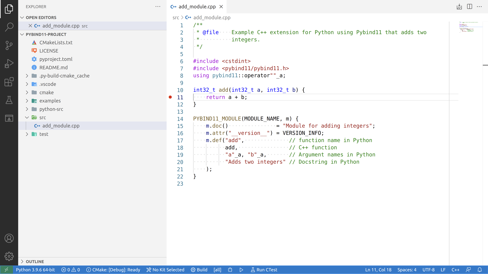

<small>[Index](index.html)</small>

# Debugging

You'll most likely end up in a situation where you'd like to debug your C++
code while it is being called from Python. For this reason, py-build-cmake 
allows you to install multiple configurations of your project (e.g. `Debug` and
`Release` builds). This page covers how to get your package ready for debugging.

You can follow along by opening the `examples/pybind11-project` folder in a new
VSCode workspace.

## pyproject.toml

In `pyproject.toml` configuration file, specify a multi-config CMake generator,
and set the configurations to `Release` and `Debug`.  
The debug and release versions of the extension module cannot have the same name,
so tell CMake to add a `_d` suffix after the name of the debug version.

```toml
[tool.py-build-cmake.linux.cmake]
generator = "Ninja Multi-Config"
config = ["Debug", "Release"]
options = { "CMAKE_DEBUG_POSTFIX:STRING" = "_d" }
```

## CMakeLists.txt and C++ code

Since the name of the Python module now depends on whether it's a debug build or
not, we have to make sure that the Python bindings use the correct name: 
In your CMakeLists.txt script, add a macro that defines the `MODULE_NAME` as the
base name of the extension module (which includes the `_d` suffix):

```cmake
Python3_add_library(_add_module MODULE "src/add_module.cpp")
target_link_libraries(_add_module PRIVATE pybind11::pybind11)
target_compile_definitions(_add_module PRIVATE
    MODULE_NAME=$<TARGET_FILE_BASE_NAME:_add_module>)
```

In your C++ code, use this macro to define your module:
```cpp
PYBIND11_MODULE(MODULE_NAME, m) {
    // ...
}
```

## Python wrapper

Finally, choose which version to load in your Python wrapper, for example by
checking whether an environment variable is set. To make sure that the generated
stubs don't try to include both the release and the debug version, add a check
for `typing.TYPE_CHECKING`:
```py
import os
import typing
if not typing.TYPE_CHECKING and os.getenv('PYBIND11_PROJECT_PYTHON_DEBUG'):
    from pybind11_project._add_module_d import *
    from pybind11_project._add_module_d import __version__
else:
    from pybind11_project._add_module import *
    from pybind11_project._add_module import __version__
```

## Building and installing the package

By default, `pip` and `build` copy your code source files to a temporary folder
before building, which means that the debugging symbols point to source files
in these (long deleted) temporary folders, which means your debugger won't be
able to locate the source code while debugging. To get around this, tell `pip`
and `build` not to use a temporary build folder using the respective
`--no-build-isolation` and `--no-isolation` flags.

## Debugging in VSCode

First, create a task to build the package. This task will be executed before 
each debug session. In `.vscode/tasks.json`, add:

```json
{
    "version": "2.0.0",
    "tasks": [
        {
            "label": "Install package (development)",
            "command": "${command:python.interpreterPath} -m pip install -e . --no-build-isolation",
            "type": "shell",
            "args": [],
            "problemMatcher": [],
            "presentation": {
                "reveal": "silent"
            },
            "group": "build"
        }
    ]
}
```

Next, define the debug configuration in `.vscode/launch.json`:
```json
{
    "version": "0.2.0",
    "configurations": [
        {
            "name": "(gdb) Launch",
            "type": "cppdbg",
            "request": "launch",
            "program": "${command:python.interpreterPath}",
            "args": [
                "examples/add_example.py"
            ],
            "stopAtEntry": false,
            "cwd": "${workspaceFolder}",
            "environment": [
                {"name": "PYBIND11_PROJECT_PYTHON_DEBUG", "value": "1"}
            ],
            "externalConsole": false,
            "MIMode": "gdb",
            "setupCommands": [
                {
                    "description": "Enable pretty-printing for gdb",
                    "text": "-enable-pretty-printing",
                    "ignoreFailures": true
                },
                {
                    "description": "Set Disassembly Flavor to Intel",
                    "text": "-gdb-set disassembly-flavor intel",
                    "ignoreFailures": true
                }
            ],
            "preLaunchTask": "Install package (development)",
        }
    ]
}
```
Note how the program to debug is the Python interpreter itself. The Python 
script to execute is passed as an argument.  
The environment variable `PYBIND11_PROJECT_PYTHON_DEBUG` is set, which causes
the Python wrapper to load the debug version of the extension module, as 
explained above.

Now open `src/add_module.cpp` and add a breakpoint in the `add` function:



If you now press <kbd>F5</kbd> to launch the debugger, the execution will be
paused when the Python script calls the `add` function, and you can debug the 
program as usual:


